# aiinvestor

一个基于 Tushare Pro 的 A 股与沪港通组合回测、策略迭代项目。

项目当前重点是构建并持续迭代一个月度调仓的 A 股选股框架，核心关注点包括：

- 使用动态股票池，而不是纯后视镜的静态冠军池
- 使用带真实交易费用的市值加权组合构建
- 使用 `core / explore / seed` 三层结构去发现和放大新强者
- 独立维护 A 股研究线与沪港通研究线，港股结论不并入 A 股 winner
- 使用本地缓存与可复现输出支持持续回测迭代

## 当前最佳策略

当前项目不再只用单一时间窗挑一个“唯一最佳策略”，而是并行维护 **4 条跟踪赢家线**：

- `since_2017_01`：长窗口
- `since_2020_01`：中窗口
- `since_2023_01`：短窗口
- `since_2025_01`：超短窗口

另外还增加了一个 **`since_2026_01` 今年窗口**，但它只用于展示当前 4 个窗口赢家在今年以来的表现：

- 不单独评选新的 `2026-window winner`
- 不加入 tracked winners 保存逻辑
- 不加入 core active family 默认比较
- 只出现在 tracked-winners 对比图里，作为今年以来的附加观察窗

自动任务会把最新赢家和指标更新到下面这个区块：

<!-- AUTO:WEIGHTED-WINNERS:START -->

项目当前维护 **两条研究路线**：

- **Path 1（胜出者核心主线）**：渐进优化路线，目标是在保持当前 winner-core 框架可交易、可控回撤的前提下，把长期 CAGR 持续推向 `25%~30%+`。
- **Path 2（无约束上限探索）**：追求更高收益上限的独立路线，可以脱离当前框架自由试验；近期重点是优先把 `2020` 与 `2023` 两个窗口推向 `40%+ CAGR`。Path 2 会独立记录自己的窗口赢家与鲁棒候选，不需要先超过 Path 1 才更新。

当前验证窗口：

- `since_2017_01`：长窗口
- `since_2020_01`：中窗口
- `since_2023_01`：短窗口
- `since_2025_01`：超短窗口
- `since_2026_01`：今年窗口（只用于展示当前四个窗口赢家今年以来表现，不单独评选 winner）

## Path 1：窗口跟踪赢家

### 2017 窗口赢家

- 策略：`core_explore_80_20_total_mv_winner_core__aggr_08_92_prom6_cash_off__port_weekly_exposure_buffered`（核心80_探索20_总市值底座_胜出者核心__进攻8/92 晋升6只(熊市空仓)__月度选股_周度仓位调整(双周确认)）
- 加权指标（CAGR / Sharpe / Max DD / Turnover）：`24.50%` / `1.1638` / `-10.65%` / `0.62`

窗口指标（截至 `2026-04-23`，权重：2017-01=100%）：

- `2017-01-01` → `2026-04-23`: Total Return `673.21%`, CAGR `24.50%`, Max DD `-10.65%`, Sharpe `1.1638`, Turnover `0.62`
- `2020-01-01` → `2026-04-23`: Total Return `258.12%`, CAGR `22.31%`, Max DD `-15.06%`, Sharpe `0.9622`, Turnover `0.53`
- `2023-01-01` → `2026-04-23`: Total Return `121.32%`, CAGR `26.91%`, Max DD `-12.55%`, Sharpe `1.1251`, Turnover `0.57`
- `2025-01-01` → `2026-04-23`: Total Return `155.08%`, CAGR `101.84%`, Max DD `-9.79%`, Sharpe `2.1047`, Turnover `1.20`
- `2026-01-01` → `2026-04-23`: Total Return `-0.43%`, CAGR `-1.30%`, Max DD `-8.35%`, Sharpe `1.4090`, Turnover `1.11`

### 2023 窗口赢家

- 策略：`core_explore_80_20_total_mv_winner_core__aggr_08_92_prom6_cash_off__port_weekly_exposure_buffered`（核心80_探索20_总市值底座_胜出者核心__进攻8/92 晋升6只(熊市空仓)__月度选股_周度仓位调整(双周确认)）
- 加权指标（CAGR / Sharpe / Max DD / Turnover）：`26.91%` / `1.1251` / `-12.55%` / `0.57`

窗口指标（截至 `2026-04-23`，权重：2023-01=100%）：

- `2017-01-01` → `2026-04-23`: Total Return `673.21%`, CAGR `24.50%`, Max DD `-10.65%`, Sharpe `1.1638`, Turnover `0.62`
- `2020-01-01` → `2026-04-23`: Total Return `258.12%`, CAGR `22.31%`, Max DD `-15.06%`, Sharpe `0.9622`, Turnover `0.53`
- `2023-01-01` → `2026-04-23`: Total Return `121.32%`, CAGR `26.91%`, Max DD `-12.55%`, Sharpe `1.1251`, Turnover `0.57`
- `2025-01-01` → `2026-04-23`: Total Return `155.08%`, CAGR `101.84%`, Max DD `-9.79%`, Sharpe `2.1047`, Turnover `1.20`
- `2026-01-01` → `2026-04-23`: Total Return `-0.43%`, CAGR `-1.30%`, Max DD `-8.35%`, Sharpe `1.4090`, Turnover `1.11`

### 2020 窗口赢家

- 策略：`core_explore_80_20_total_mv_winner_core__aggr_10_90_prom6__sat_three_stage_buffered`（核心80_探索20_总市值底座_胜出者核心__进攻10/90 晋升6只__卫星周频三档风控(双周确认)）
- 加权指标（CAGR / Sharpe / Max DD / Turnover）：`25.78%` / `0.9271` / `-21.59%` / `0.67`

窗口指标（截至 `2026-04-23`，权重：2020-01=100%）：

- `2017-01-01` → `2026-04-23`: Total Return `500.19%`, CAGR `21.17%`, Max DD `-23.49%`, Sharpe `0.8949`, Turnover `0.66`
- `2020-01-01` → `2026-04-23`: Total Return `327.42%`, CAGR `25.78%`, Max DD `-21.59%`, Sharpe `0.9271`, Turnover `0.67`
- `2023-01-01` → `2026-04-23`: Total Return `118.79%`, CAGR `26.48%`, Max DD `-27.62%`, Sharpe `0.8629`, Turnover `0.69`
- `2025-01-01` → `2026-04-23`: Total Return `140.67%`, CAGR `93.23%`, Max DD `-10.10%`, Sharpe `1.9482`, Turnover `1.05`
- `2026-01-01` → `2026-04-23`: Total Return `29.68%`, CAGR `118.09%`, Max DD `-3.61%`, Sharpe `3.0961`, Turnover `0.83`

### 2025 窗口赢家

- 策略：`core_explore_80_20_total_mv_winner_core__aggr_08_92_prom6_core_6_1__port_weekly_exposure_asym`（核心80_探索20_总市值底座_胜出者核心__进攻8/92 晋升6只(核心6-1动量)__月度选股_周度仓位调整(快减慢加)）
- 加权指标（CAGR / Sharpe / Max DD / Turnover）：`103.32%` / `2.3086` / `-9.54%` / `1.39`

窗口指标（截至 `2026-04-23`，权重：2025-01=100%）：

- `2017-01-01` → `2026-04-23`: Total Return `338.13%`, CAGR `17.15%`, Max DD `-44.24%`, Sharpe `0.7541`, Turnover `0.97`
- `2020-01-01` → `2026-04-23`: Total Return `222.94%`, CAGR `20.33%`, Max DD `-41.75%`, Sharpe `0.7626`, Turnover `1.00`
- `2023-01-01` → `2026-04-23`: Total Return `127.42%`, CAGR `27.95%`, Max DD `-36.71%`, Sharpe `0.9574`, Turnover `1.07`
- `2025-01-01` → `2026-04-23`: Total Return `157.58%`, CAGR `103.32%`, Max DD `-9.54%`, Sharpe `2.3086`, Turnover `1.39`
- `2026-01-01` → `2026-04-23`: Total Return `24.48%`, CAGR `92.88%`, Max DD `0.00%`, Sharpe `3.4328`, Turnover `1.36`

## Path 1：鲁棒候选

### 四窗口鲁棒候选

- 策略：`core_explore_80_20_total_mv_winner_core__aggr_08_92_prom6__port_weekly_exposure_buffered`（核心80_探索20_总市值底座_胜出者核心__进攻8/92 晋升6只__月度选股_周度仓位调整(双周确认)）
- 鲁棒指标（平均 CAGR / 最低 CAGR / 平均 Sharpe / 最差 Max DD / 平均 Turnover）：`47.55%` / `27.01%` / `1.1801` / `-31.84%` / `0.96`

窗口指标：

- `2017-01-01` → `2026-04-23`: Total Return `873.65%`, CAGR `27.61%`, Max DD `-25.40%`, Sharpe `1.0369`, Turnover `0.88`
- `2020-01-01` → `2026-04-23`: Total Return `354.68%`, CAGR `27.01%`, Max DD `-23.89%`, Sharpe `0.9116`, Turnover `0.86`
- `2023-01-01` → `2026-04-23`: Total Return `132.72%`, CAGR `28.84%`, Max DD `-31.84%`, Sharpe `0.8459`, Turnover `0.95`
- `2025-01-01` → `2026-04-23`: Total Return `163.39%`, CAGR `106.75%`, Max DD `-10.61%`, Sharpe `1.9259`, Turnover `1.16`
- `2026-01-01` → `2026-04-23`: Total Return `41.19%`, CAGR `181.45%`, Max DD `-2.78%`, Sharpe `2.8968`, Turnover `1.00`

## Path 2：窗口跟踪赢家

### 2017 窗口赢家（Path 2）

- 策略：`core_explore_80_20_equal_weight_winner_core__aggr_03_97_prom2_core_6_1_cash_off_and_risk50_cap80`（核心80_探索20_等权底座_胜出者核心__进攻3/97 晋升2只(核心6-1动量, 熊市降到50% and, 单票80%)）
- 加权指标（CAGR / Sharpe / Max DD / Turnover）：`28.48%` / `1.0116` / `-46.94%` / `3.89`

窗口指标（截至 `2026-04-23`，权重：2017-01=100%）：

- `2017-01-01` → `2026-04-23`: Total Return `936.91%`, CAGR `28.48%`, Max DD `-46.94%`, Sharpe `1.0116`, Turnover `3.89`
- `2020-01-01` → `2026-04-23`: Total Return `351.04%`, CAGR `26.85%`, Max DD `-54.29%`, Sharpe `0.8614`, Turnover `4.52`
- `2023-01-01` → `2026-04-23`: Total Return `151.85%`, CAGR `31.93%`, Max DD `-31.88%`, Sharpe `1.0972`, Turnover `4.28`
- `2025-01-01` → `2026-04-23`: Total Return `176.85%`, CAGR `114.63%`, Max DD `-12.41%`, Sharpe `1.9988`, Turnover `6.55`
- `2026-01-01` → `2026-04-23`: Total Return `31.70%`, CAGR `128.43%`, Max DD `0.00%`, Sharpe `4.4107`, Turnover `4.84`

### 2023 窗口赢家（Path 2）

- 策略：`core_explore_80_20_equal_weight_winner_core__aggr_05_95_prom3_core_6_1_full_risk_cap80`（核心80_探索20_等权底座_胜出者核心__进攻5/95 晋升3只(核心6-1动量, 关闭熊市降仓, 单票80%)）
- 加权指标（CAGR / Sharpe / Max DD / Turnover）：`58.03%` / `1.1874` / `-50.82%` / `5.32`

窗口指标（截至 `2026-04-23`，权重：2023-01=100%）：

- `2017-01-01` → `2026-04-23`: Total Return `399.05%`, CAGR `18.80%`, Max DD `-68.09%`, Sharpe `0.6650`, Turnover `5.01`
- `2020-01-01` → `2026-04-23`: Total Return `334.38%`, CAGR `26.10%`, Max DD `-68.64%`, Sharpe `0.6988`, Turnover `5.95`
- `2023-01-01` → `2026-04-23`: Total Return `359.72%`, CAGR `58.03%`, Max DD `-50.82%`, Sharpe `1.1874`, Turnover `5.32`
- `2025-01-01` → `2026-04-23`: Total Return `196.18%`, CAGR `125.77%`, Max DD `-14.79%`, Sharpe `1.9583`, Turnover `6.29`
- `2026-01-01` → `2026-04-23`: Total Return `49.70%`, CAGR `235.45%`, Max DD `0.00%`, Sharpe `3.7777`, Turnover `4.09`

### 2020 窗口赢家（Path 2）

- 策略：`core_explore_80_20_equal_weight_winner_core__aggr_03_97_prom2_core_6_1_cash_off_and_cap80`（核心80_探索20_等权底座_胜出者核心__进攻3/97 晋升2只(核心6-1动量, 熊市空仓 and, 单票80%)）
- 加权指标（CAGR / Sharpe / Max DD / Turnover）：`32.07%` / `1.1480` / `-23.02%` / `2.95`

窗口指标（截至 `2026-04-23`，权重：2020-01=100%）：

- `2017-01-01` → `2026-04-23`: Total Return `713.55%`, CAGR `25.18%`, Max DD `-17.73%`, Sharpe `1.0604`, Turnover `2.82`
- `2020-01-01` → `2026-04-23`: Total Return `482.11%`, CAGR `32.07%`, Max DD `-23.02%`, Sharpe `1.1480`, Turnover `2.95`
- `2023-01-01` → `2026-04-23`: Total Return `93.52%`, CAGR `21.90%`, Max DD `-14.67%`, Sharpe `1.0296`, Turnover `3.02`
- `2025-01-01` → `2026-04-23`: Total Return `200.20%`, CAGR `128.06%`, Max DD `-12.42%`, Sharpe `2.1335`, Turnover `5.80`
- `2026-01-01` → `2026-04-23`: Total Return `8.01%`, CAGR `26.02%`, Max DD `0.00%`, Sharpe `2.6663`, Turnover `6.00`

### 2025 窗口赢家（Path 2）

- 策略：`core_explore_80_20_total_mv_winner_core__aggr_03_97_prom2_core_6_1_cash_off_and_cap80`（核心80_探索20_总市值底座_胜出者核心__进攻3/97 晋升2只(核心6-1动量, 熊市空仓 and, 单票80%)）
- 加权指标（CAGR / Sharpe / Max DD / Turnover）：`145.68%` / `2.1978` / `-12.20%` / `5.29`

窗口指标（截至 `2026-04-23`，权重：2025-01=100%）：

- `2017-01-01` → `2026-04-23`: Total Return `752.80%`, CAGR `25.82%`, Max DD `-17.40%`, Sharpe `1.0894`, Turnover `2.87`
- `2020-01-01` → `2026-04-23`: Total Return `336.60%`, CAGR `26.20%`, Max DD `-28.09%`, Sharpe `1.0012`, Turnover `2.84`
- `2023-01-01` → `2026-04-23`: Total Return `95.86%`, CAGR `22.34%`, Max DD `-14.85%`, Sharpe `1.0362`, Turnover `3.06`
- `2025-01-01` → `2026-04-23`: Total Return `231.52%`, CAGR `145.68%`, Max DD `-12.20%`, Sharpe `2.1978`, Turnover `5.29`
- `2026-01-01` → `2026-04-23`: Total Return `7.94%`, CAGR `25.76%`, Max DD `-0.09%`, Sharpe `2.6298`, Turnover `6.08`

## Path 2：鲁棒候选

### 四窗口鲁棒候选

- 策略：`core_explore_80_20_total_mv_winner_core__aggr_05_95_prom3_core_6_1_full_risk_cap60`（核心80_探索20_总市值底座_胜出者核心__进攻5/95 晋升3只(核心6-1动量, 关闭熊市降仓, 单票60%)）
- 鲁棒指标（平均 CAGR / 最低 CAGR / 平均 Sharpe / 最差 Max DD / 平均 Turnover）：`58.88%` / `17.57%` / `1.1458` / `-66.07%` / `5.56`

窗口指标：

- `2017-01-01` → `2026-04-23`: Total Return `353.09%`, CAGR `17.57%`, Max DD `-65.24%`, Sharpe `0.6373`, Turnover `5.16`
- `2020-01-01` → `2026-04-23`: Total Return `239.88%`, CAGR `21.31%`, Max DD `-66.07%`, Sharpe `0.6184`, Turnover `5.66`
- `2023-01-01` → `2026-04-23`: Total Return `305.89%`, CAGR `52.24%`, Max DD `-49.35%`, Sharpe `1.1933`, Turnover `5.43`
- `2025-01-01` → `2026-04-23`: Total Return `229.22%`, CAGR `144.41%`, Max DD `-17.33%`, Sharpe `2.1342`, Turnover `5.98`
- `2026-01-01` → `2026-04-23`: Total Return `47.08%`, CAGR `218.20%`, Max DD `0.00%`, Sharpe `3.8625`, Turnover `4.65`

<!-- AUTO:WEIGHTED-WINNERS:END -->

当不同窗口的赢家不同时，项目会同时保留它们，作为防过拟合的护栏。README 中的 `strategy_comparison_*` 图展示跟踪赢家，`strategy_family_*` 图现在只展示默认参与展示的 **core active family**。更宽的 **research active family** 仍继续参与回测与迭代，用于保留更大的候选范围；历史实验策略会保留在 `results/` 中作为 **archive family** 供追溯，但默认不再进入 README、默认图表和默认比较脚本。

两个路径在四个窗口下的赢家变化历史，持续记录在：

- [HISTORY.md](HISTORY.md)
- [docs/path1_plan.md](docs/path1_plan.md)
- [docs/path2_plan.md](docs/path2_plan.md)

## 沪港通独立研究线

沪港通结果独立维护，不并入 A 股 `winner_only` 结论。`2026-04-22` 起，港股窗口的 `sample_start` 统一对齐到**首个可执行调仓点**，因此本节数值应以这次重算后的基线为准。

当前 tracked winners（截至 `2026-04-23`）：

当前港股 `since_2017_01 / since_2020_01` 两个窗口都从首个可执行调仓点 `2020-12-01` 起算，因此这两个窗口的港股指标当前相同。

- Path 1：
  - `since_2017_01 / since_2020_01 / since_2023_01 / since_2025_01`：`hkconnect_path1_monthly_equal_buffered`
  - robust candidate：`hkconnect_path1_monthly_equal_buffered`
- Path 2：
  - `since_2017_01 / since_2020_01`：`hkconnect_path2_theme_monthly`
  - `since_2023_01`：`hkconnect_path2_theme_biweekly`
  - `since_2025_01`：`hkconnect_path2_breakout_biweekly`
  - robust candidate：`hkconnect_path2_theme_biweekly`
- `since_2026_01`：只做观察，不进入 tracked winners；当前 raw leader 分别是 `hkconnect_path1_monthly_lowvol`（Path 1）与 `hkconnect_path2_breakout_monthly`（Path 2）

关键窗口指标：

- Path 1 `since_2020_01`：`23.43% CAGR / -14.78% MaxDD / 1.3685 Sharpe / 2.88 Turnover`
- Path 1 `since_2023_01`：`34.29% CAGR / -14.78% MaxDD / 1.7026 Sharpe / 2.89 Turnover`
- Path 1 `since_2025_01`：`41.42% CAGR / -14.78% MaxDD / 1.5498 Sharpe / 3.47 Turnover`
- Path 2 `since_2020_01`：`23.41% CAGR / -18.86% MaxDD / 1.1891 Sharpe / 6.64 Turnover`
- Path 2 `since_2023_01`：`48.66% CAGR / -16.47% MaxDD / 1.5256 Sharpe / 14.46 Turnover`
- Path 2 `since_2025_01`：`137.32% CAGR / -8.87% MaxDD / 2.1812 Sharpe / 18.58 Turnover`（`hkconnect_path2_breakout_biweekly`）

相关产物：

- [docs/path1_plan_hkconnect.md](docs/path1_plan_hkconnect.md)
- [docs/path2_plan_hkconnect.md](docs/path2_plan_hkconnect.md)
- [results_hkconnect/tracked_winners_hkconnect.json](results_hkconnect/tracked_winners_hkconnect.json)

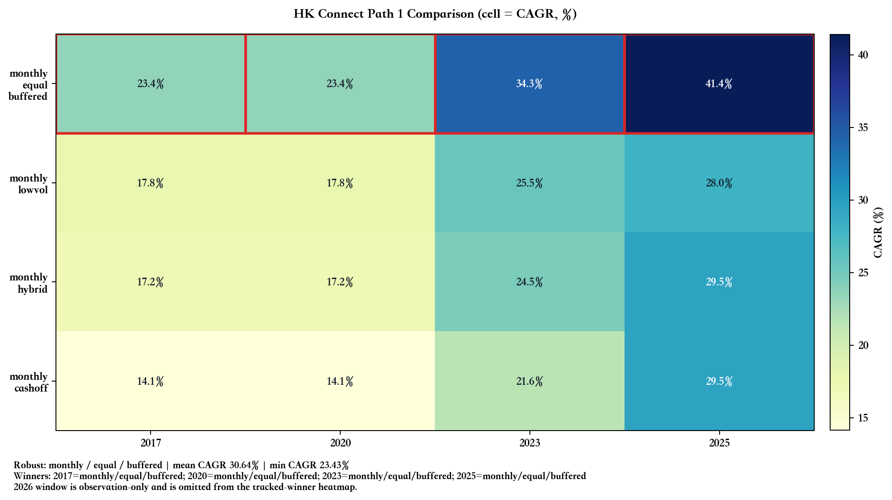

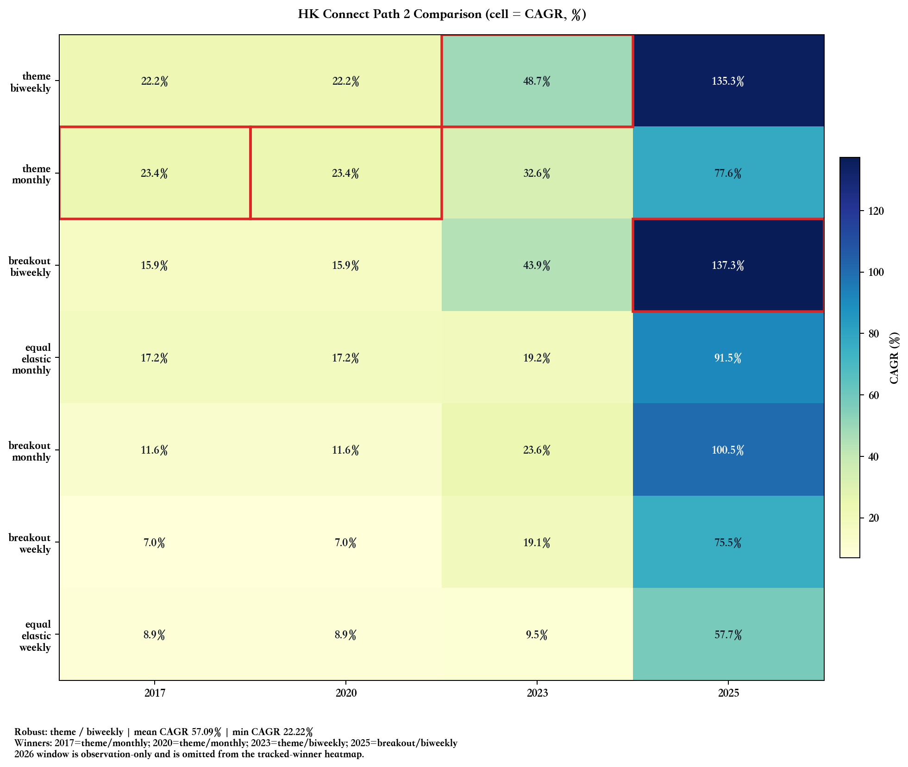

当前主策略框架使用：

- 核心池：`沪深300 + 科创50`
- 探索池：`中证500 + 科创100 + 科创200`
- 月度调仓
- 前复权价格
- 总市值底座
- 从 explore/seed 晋升到 `winner_core`
- 按不同跟踪线调整 `winner_core` 的稳定核心 / 晋升核心分配
- 真实买卖佣金与印花税

## 中文详细说明

README 中间这部分只解释当前研究框架，不重复写死顶部自动区块里的最新数值。

当前项目已经从“只追一个总冠军策略”，演进成 **两条研究路径 + 四个验证窗口**：

- **Path 1：渐进优化路径**
  - 仍然基于 `winner_core` 主线持续优化
  - 目标是在可交易、可控回撤的前提下，把现阶段常见的 `20%~26% CAGR` 推向 `25%~30%+`
  - 重点关注：晋升机制、核心/卫星结构、仓位节奏、系统风控
  - 当前已经增加了显式研究计划文件：[docs/path1_plan.md](docs/path1_plan.md)
  - 后续迭代应优先围绕计划文件中定义的 `3-5` 个方向推进，而不是无差别扫全部历史变体

- **Path 2：无约束上限探索**
  - 不受当前框架限制，可以尝试更激进或完全不同的方案
  - 目标优先冲收益上限，近期重点是先把 `2020` 和 `2023` 两个窗口推向 `40%+ CAGR`
  - 这条路径会独立记录自己的窗口赢家与鲁棒候选，不需要先打赢 Path 1 才保留
  - 当前也已经增加显式研究计划文件：[docs/path2_plan.md](docs/path2_plan.md)
  - 当前已开始独立候选生成，重点拆成三类方向：
    - 高集中突破
    - 高成长主线
    - 动量 / 等权高弹性

四个验证窗口分别是：

- `2017-01 起`：长窗口，检验跨牛熊长期稳定性
- `2020-01 起`：中窗口，当前最重要的主比较窗口
- `2023-01 起`：短窗口，检验近年行情适应性
- `2025-01 起`：超短窗口，检验最新市场环境下的爆发力

### 当前主框架

目前项目的主框架仍然是：

- 动态股票池，而不是固定后视镜冠军池
- `核心 / 探索 / 种子` 三层结构，负责“发现 -> 验证 -> 放大”
- `winner_core` 负责把探索层跑出来的强者逐步提升为核心重仓
- 真实计入佣金、印花税和调仓成本

核心资产的发现逻辑，当前更强调：

- 中期动量与短期回避
- 行业强度与行业内龙头强度
- 业绩加速与质量过滤
- 晋升核心后的分阶段加仓

### Active Family 与 Archive Family

当前项目不再把“历史上试过的所有策略”都混在默认比较里，而是分成两层：

- **active family**
  - 当前仍在持续研究、会进入 README 默认展示和默认图表的策略集合
  - 目前主要集中在 `核心80_探索20` 的 `index_core / winner_core` 主线，以及其现役卫星风控变体

- **archive family**
  - 历史上做过、但当前不再作为默认比较对象的旧策略
  - 结果仍保留在 `results/` 中方便追溯
  - 默认不会再进入 README 顶部摘要、默认图表和默认比较脚本

这样做的目的，是把当前真正还在竞争的策略与历史试验策略隔离开，避免 README 和图表被旧版本噪音干扰。

### 结果对比图

下面四张图分别展示：

- `2017-01 起` 长样本
- `2020-01 起` 中样本
- `2023-01 起` 短样本
- `2025-01 起` 超短样本
- `2026-01 起` 今年窗口（只展示当前四个窗口赢家、基准和静态参考的今年表现）

每张图都包含：

- 净值曲线
- 风险收益散点
- 指标表

图中最关键的策略包括：

- `SSE Composite`：上证指数基准，用于看策略相对大盘的超额表现
- `Large Cap Static`：你最早给定的大市值池，当前放在 `2020-01`、`2023-01` 与 `2025-01` 三个窗口里作为静态参考
- `Kechuang Static`：你最早给定的科创池，因科创板发布时间较晚，当前放在 `2020-01`、`2023-01` 与 `2025-01` 三个窗口
- `80/20 Index Core`：优化前的动态基线
- `80/20 Winner Core`：标准版胜出者核心
- `80/20 Winner Core (Aggressive)`：当前长中样本的最佳动态版本

#### 2017-01 起

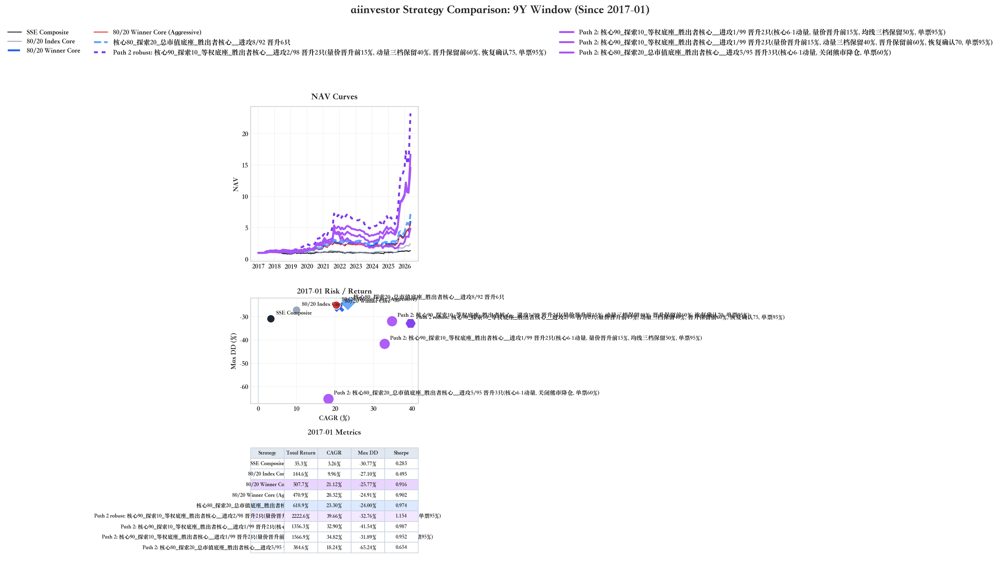

#### 2020-01 起

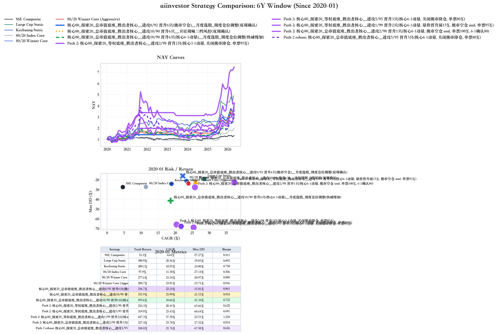

#### 2023-01 起

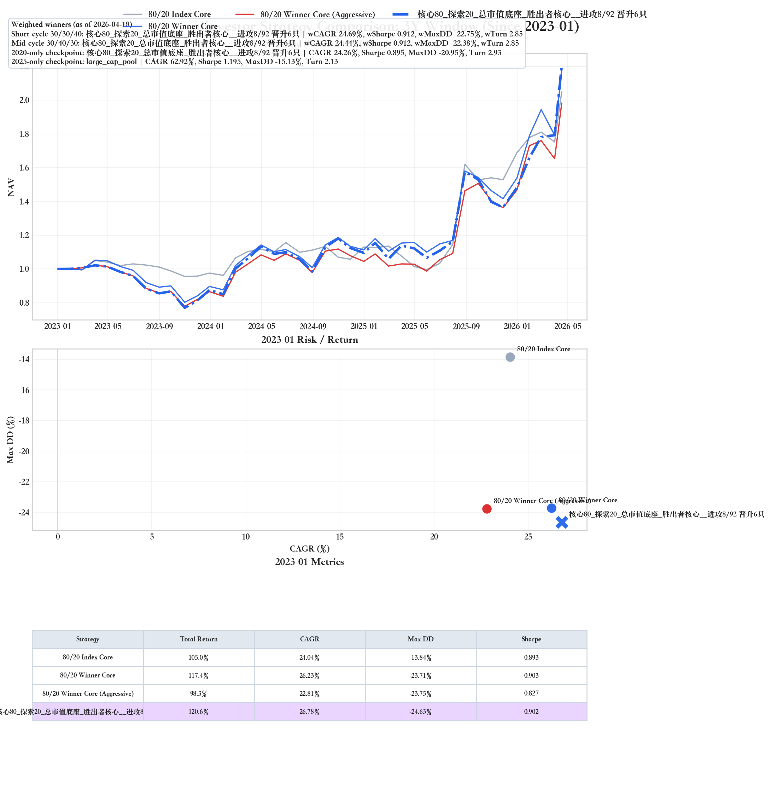

#### 2025-01 起

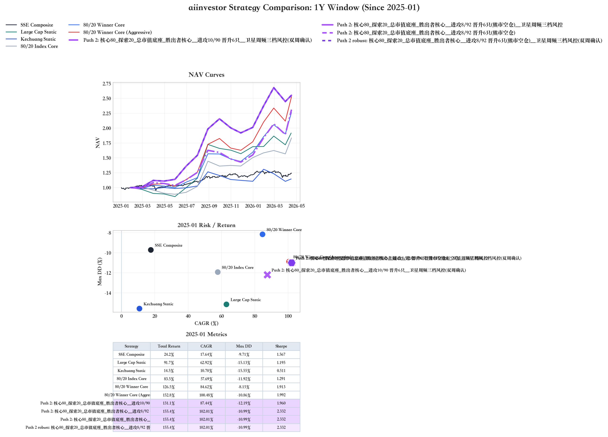

#### 2026-01 起（今年窗口，仅 tracked winners）

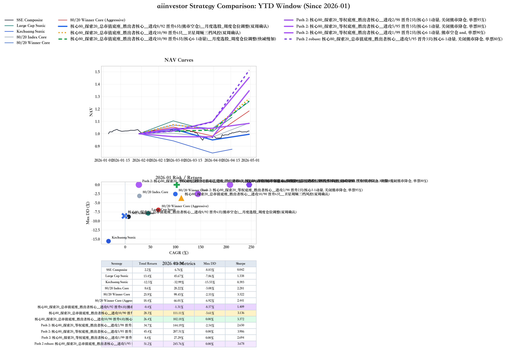

### Core Active Family 对比图

下面四张图只展示当前默认参与展示的 **core active family**。  
更宽的 **research active family** 仍然继续跑，用于给自动迭代提供更大的候选空间；已经淘汰的旧策略则保留在 `results/` 中作为 archive family，默认不再出现在这里。

#### 2017-01 起（core active family）

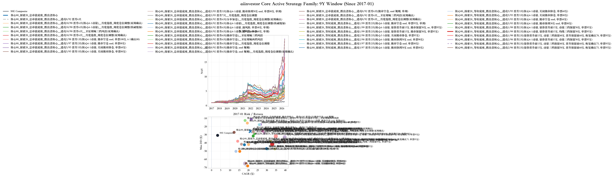

#### 2020-01 起（core active family）

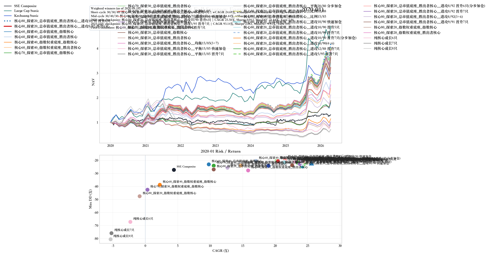

#### 2023-01 起（core active family）

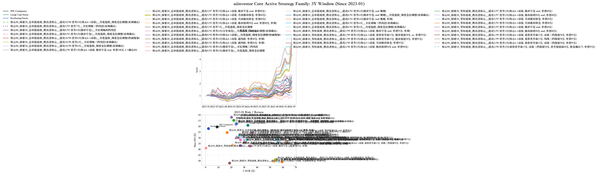

#### 2025-01 起（core active family）

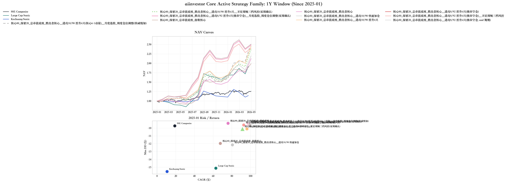

## 实盘交易平台（MVP）

项目当前已经同步搭建了一个可用于日常实盘操作的网页平台，定位是：

- 单用户
- 多账户
- 策略白名单只来自 tracked winners
- 人工执行调仓，不直接对接券商交易接口
- 研究端低频更新，实盘端日频查看与执行

当前实盘平台主程序：

- [live_trading_platform.py](live_trading_platform.py)
- [scripts/export_live_platform_data.py](scripts/export_live_platform_data.py)

### 当前已支持的能力

- 展示 tracked winners 白名单策略
- 单用户、多账户管理
- 账户绑定策略
- 手工输入 / 编辑当前持仓
- 自动拉取当前价格
  - 交易时间优先分钟线实时价
  - 非交易时间显示上一交易日收盘价
- 展示当前持仓盈亏、账户总盈亏、账户总盈亏率
- 生成正式调仓单与偏离修正单
- 任务页逐笔录入实际成交
- 当累计成交与建议股数一致时自动标记任务为已执行
- 交易流水记录
  - 实际成交
  - 估算执行
  - 手工持仓同步
  - 手工新增 / 编辑交易

### 当前实盘平台的使用方式

1. 研究端先导出可实盘策略快照
2. 在实盘平台中创建账户并绑定某个 tracked winner 策略
3. 手工录入当前账户持仓
4. 每天查看今日建议
   - 正式调仓
   - 偏离修正
   - 策略切换建议
   - 无需操作
5. 生成任务单并人工去券商执行
6. 在任务页逐笔录入实际成交，平台自动回写账户

### 启动方式

```bash
cd /Users/valselee/my-code/aiinvestor
.venv/bin/python scripts/export_live_platform_data.py
.venv/bin/python live_trading_platform.py
```

浏览器打开：

- [http://127.0.0.1:8787](http://127.0.0.1:8787)

### 当前定位

这套平台当前仍然是 **Stage 1：研究结果到人工执行之间的操作平台**。

也就是说：

- 平台负责生成建议与任务
- 你负责实际下单
- 平台负责回写与留痕

后续如果需要，再继续往 CSV 导入、券商接口对接、自动执行等方向扩展。
