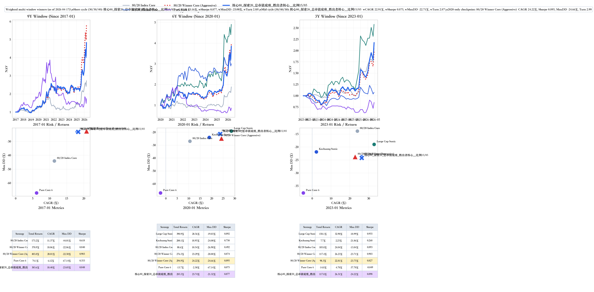

# aiinvestor

An A-share portfolio backtesting project based on Tushare Pro.

The project focuses on building and iterating a monthly-rebalanced stock selection framework for the China A-share market, with emphasis on:

- dynamic stock pools instead of hindsight-picked static lists
- market-cap weighted portfolio construction with realistic trading costs
- core / explore / seed style discovery logic for finding emerging leaders
- reproducible outputs with local caching

## Current Best Strategy

This project no longer picks a single “best” strategy by one sample window.
Instead, we keep **three tracked winners in parallel** using **weighted multi-window scoring** across:

- `since_2017_01` (long window)
- `since_2020_01` (mid window)
- `since_2023_01` (short window)

The automation updates the tracked winners and their latest metrics here:

<!-- AUTO:WEIGHTED-WINNERS:START -->

This repo tracks *three winners in parallel* using weighted multi-window scoring across the three validation windows:

- `since_2017_01` (long window)
- `since_2020_01` (mid window)
- `since_2023_01` (short window)

### Short-cycle Winner (30/30/40)

- Strategy: `core_explore_80_20_total_mv_winner_core__share_15_85_hold_4_6` (核心80_探索20_总市值底座_胜出者核心__比例15/85)
- Weighted (CAGR / Sharpe / Max DD / Turnover): `23.16%` / `0.8767` / `-23.00%` / `2.88`

Window metrics (as of `2026-04-17`, weights: 2017-01=30%, 2020-01=30%, 2023-01=40%):

- `2017-01-01` → `2026-04-17`: CAGR `18.40%`, Max DD `-23.05%`, Sharpe `0.8484`
- `2020-01-01` → `2026-04-17`: CAGR `23.74%`, Max DD `-21.32%`, Sharpe `0.8772`
- `2023-01-01` → `2026-04-17`: CAGR `26.31%`, Max DD `-24.22%`, Sharpe `0.8976`

### Mid-cycle Winner (30/40/30)

- Strategy: `core_explore_80_20_total_mv_winner_core__share_15_85_hold_4_6` (核心80_探索20_总市值底座_胜出者核心__比例15/85)
- Weighted (CAGR / Sharpe / Max DD / Turnover): `22.91%` / `0.8747` / `-22.71%` / `2.87`

Window metrics (as of `2026-04-17`, weights: 2017-01=30%, 2020-01=40%, 2023-01=30%):

- `2017-01-01` → `2026-04-17`: CAGR `18.40%`, Max DD `-23.05%`, Sharpe `0.8484`
- `2020-01-01` → `2026-04-17`: CAGR `23.74%`, Max DD `-21.32%`, Sharpe `0.8772`
- `2023-01-01` → `2026-04-17`: CAGR `26.31%`, Max DD `-24.22%`, Sharpe `0.8976`

### 2020-Window Winner (2020-only checkpoint)

- Strategy: `core_explore_80_20_total_mv_winner_core__aggr_10_90_fast_ramp` (核心80_探索20_总市值底座_胜出者核心__进攻10/90 快速加仓)
- Weighted (CAGR / Sharpe / Max DD / Turnover): `24.22%` / `0.8950` / `-24.66%` / `2.99`

Window metrics (as of `2026-04-17`, weights: 2020-01=100%):

- `2017-01-01` → `2026-04-17`: CAGR `20.81%`, Max DD `-22.50%`, Sharpe `0.9028`
- `2020-01-01` → `2026-04-17`: CAGR `24.22%`, Max DD `-24.66%`, Sharpe `0.8950`
- `2023-01-01` → `2026-04-17`: CAGR `22.81%`, Max DD `-23.75%`, Sharpe `0.8270`

<!-- AUTO:WEIGHTED-WINNERS:END -->

When the winner tracks differ, we keep all of them (short-cycle vs mid-cycle vs 2020-only checkpoint) as an anti-overfitting guardrail.
The comparison chart in `docs/strategy_comparison.png` highlights the tracked winners.

This strategy uses:

- core pool: `沪深300 + 科创50`
- explore pool: `中证500 + 科创100 + 科创200`
- monthly rebalance
- forward-adjusted prices
- market-cap base weights
- winner promotion from explore/seed into core
- more aggressive winner-core allocation (stable/promoted ≈ 10%/90%) with faster ramp for newly promoted names
- realistic buy/sell commissions and stamp duty

## Strategy Structure

The project currently contains several strategy branches for comparison:

- `index_core`: the core sleeve stays anchored to index constituents
- `winner_core`: strong names discovered in explore/seed can be promoted into the core sleeve
- `pure_core_growth`: an experimental concentrated growth-only version without market risk control

The main production-style framework is `core_explore`, which combines:

- a core sleeve for relatively stable leaders
- an explore sleeve for faster iteration
- a seed sleeve for earlier-stage discovery
- staged promotion and slower demotion for promoted core names

## Data And Rules

- data source: `Tushare Pro`
- prices: forward-adjusted close built from `daily.close` and `adj_factor`
- market cap: `daily_basic.total_mv`
- rebalance timing:
  - use the last trading day of each month to compute target weights
  - trade on the first trading day of the next month
- costs:
  - buy commission: `0.03%`
  - sell commission: `0.03%`
  - stamp duty:
    - `0.10%` before `2023-08-28`
    - `0.05%` on and after `2023-08-28`

## Repository Files

- `backtest_marketcap_etf.py`: main backtest program
- `requirements.txt`: Python dependencies
- `README.md`: project overview

The following directories are intentionally kept out of git:

- `data_cache/`: local Tushare cache
- `results/`: backtest output files
- `.venv/`: local Python environment

## Quick Start

```bash
python3 -m venv .venv
.venv/bin/pip install -r requirements.txt
.venv/bin/python backtest_marketcap_etf.py
```

## Output Files

Each strategy run writes results under `results/`, including:

- `equity_curve.csv`
- `monthly_returns.csv`
- `annual_returns.csv`
- `latest_weights.csv`
- `turnover.csv`
- `summary.json`
- `equity_curve.png`

There is also a strategy comparison table:

- `results/strategy_comparison_base_method.csv`

## Notes

- The current implementation includes a Tushare token directly in the script for local research use.
- Local cache is used to reduce repeated API requests.
- Some historical index constituents may be unavailable in `stock_basic`; these are logged and excluded explicitly instead of being silently skipped.

## Status

The project has already been initialized as a git repository and synced to GitHub:

- repository: `willyufan/aiinvestor`
- URL: `https://github.com/willyufan/aiinvestor`

## 中文策略说明

当前项目里最值得继续迭代的版本，不是纯核心集中策略，而是：

- `核心80_探索20_总市值底座_胜出者核心 (进攻10/90 快速加仓)`

这套框架的核心思想是：

- 核心池提供相对稳定的底座，来源于 `沪深300 + 科创50`
- 探索池和种子池负责更早发现潜在强者，来源于 `中证500 + 科创100 + 科创200`
- 强势个股不是一直留在卫星仓，而是可以逐步晋升到 `winner_core`
- 核心仓内部继续拆成“稳定核心”和“晋升核心”，前者更稳，后者更偏进攻

这次重点优化的 4 个方向如下：

1. 行业强度信号接入探索 / 种子层  
   探索和种子层不再只看个股涨幅，而是同时看行业强度、行业内龙头强度、动量和突破信号，尽量做到“先选对赛道，再选赛道里的强股”。

2. 双轨晋升到 `winner_core`  
   既保留普通晋升路径，也保留快速晋升路径。普通晋升要求更连续，快速晋升要求更强的行业强度、放量和突破确认。

3. 晋升核心分阶段加仓  
   新晋升的核心股不是一步到位给满，而是按阶段逐步放大权重，减少误判时的大回撤。

4. 核心内部拆成“稳定核心 + 晋升核心”  
   稳定核心更偏成熟龙头，晋升核心更偏正在走强的新胜出者，组合层面兼顾稳定性和超额收益。

### 三窗口验证结果

为了减少过拟合风险，当前每个重要策略都会同时跑三档样本：

- `2017-01 起`：长样本，约 9 年
- `2020-01 起`：中样本，约 6 年
- `2023-01 起`：短样本，约 3 年

当前“生产候选版本”仍然是：

- `核心80_探索20_总市值底座_胜出者核心 (进攻10/90 快速加仓)`

它在三档样本里的表现分别是：

- `2017-01 起`：累计收益 `472.27%`，CAGR `20.55%`，最大回撤 `-22.50%`，夏普 `0.8980`
- `2020-01 起`：累计收益 `282.72%`，CAGR `23.60%`，最大回撤 `-24.66%`，夏普 `0.8845`
- `2023-01 起`：累计收益 `92.11%`，CAGR `21.64%`，最大回撤 `-23.75%`，夏普 `0.8062`

以 `核心80_探索20_总市值底座_指数核心` 作为优化前基线，对比优化后的 `核心80_探索20_总市值底座_胜出者核心 (进攻10/90 快速加仓)`：

- `2020-01` 主样本里，累计收益从 `83.19%` 提升到 `282.72%`
- `2020-01` 主样本里，CAGR 从 `10.03%` 提升到 `23.60%`
- `2017-01` 长样本里，累计收益从 `105.60%` 提升到 `472.27%`
- `2017-01` 长样本里，CAGR 从 `8.03%` 提升到 `20.55%`
- 最新组合持仓仍然明显集中在少数胜出者核心上

这一轮新增的关键动作是：

- 修正 `winner_core` 的降级方向，让晋升核心真正按“连续掉队”而不是“连续保留”来退出
- 把风险状态下的卫星仓暴露进一步收缩到 `0.30`，让探索 / 种子层在逆风期更主动减仓
- 把核心内部权重进一步调整为 `稳定核心 10% + 晋升核心 90%`，并把新晋升核心的加仓节奏提前，让真正跑出来的胜出者更早拿到更高权重

这说明当前动态发现框架已经不只是“能跑通”，而是在长中短三档窗口里都具备了比较稳定的超额收益能力。

但也要明确一点：

- 这套“市场发现”策略目前仍然明显落后于你最初给定的静态冠军池
- `大市值池`：累计收益 `390.94%`，CAGR `28.56%`，最大回撤 `-19.03%`
- `科创选股`：累计收益 `200.11%`，CAGR `18.95%`，最大回撤 `-24.00%`

所以现在更准确的结论是：

- 这轮优化已经把动态发现框架从“能跑”推到“有明显改进”
- 但它还没有做到“比后视镜精选冠军池更早、更重地抓住真正的大牛股”
- 下一步最有价值的方向，仍然是继续加强探索 / 种子层的早期发现能力，而不是把仓位继续往纯核心集中上推

另外，短窗口也给了一个重要提示：

- `2023-01` 这档短样本里，最好的并不是“进攻10/90 快速加仓”，而是标准版 `核心80_探索20_总市值底座_胜出者核心`
- 这说明策略越激进，越容易在短窗口里出现表现顺序切换
- 也正因为如此，README 和图表现在都会同时展示 `2017 / 2020 / 2023` 三档结果，而不再只看单一窗口

### 结果对比图

下图对比了几个最关键版本，并同时展示：

- `2017-01 起` 长样本
- `2020-01 起` 中样本
- `2023-01 起` 短样本

每一列都包含：

- 净值曲线
- 风险收益散点
- 指标表

图中最关键的策略包括：

- `Large Cap Static`：你最早给定的大市值池，当前放在 `2020-01` 与 `2023-01` 两个窗口里作为静态参考
- `Kechuang Static`：你最早给定的科创池，因科创板发布时间较晚，只放在 `2020-01` 与 `2023-01` 两个窗口
- `80/20 Index Core`：优化前的动态基线
- `80/20 Winner Core`：标准版胜出者核心
- `80/20 Winner Core (Aggressive)`：当前长中样本的最佳动态版本
- `Pure Core 6`：纯核心集中实验版


