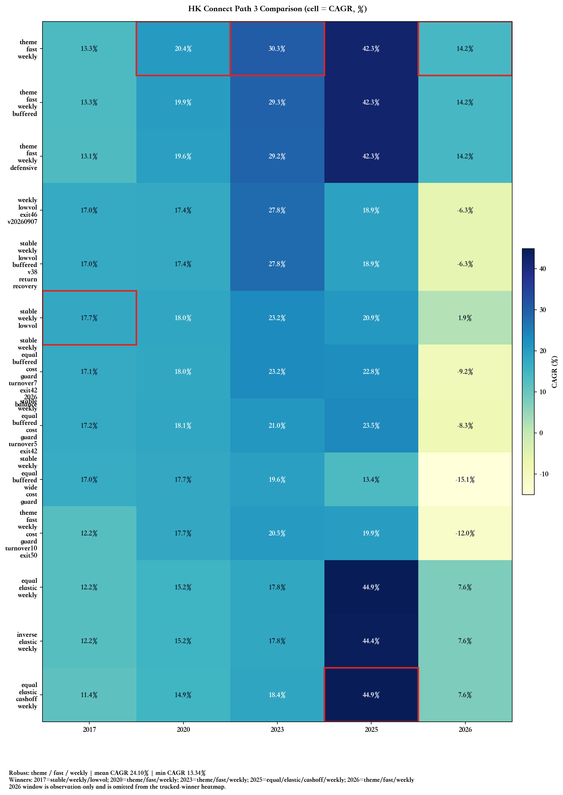

# aiinvestor

一个基于 Tushare Pro 的 A 股与沪港通组合回测、策略迭代项目。

项目当前重点是构建并持续迭代一个月度调仓的 A 股选股框架，核心关注点包括：

- 使用动态股票池，而不是纯后视镜的静态冠军池
- 使用带真实交易费用的市值加权组合构建
- 使用 `core / explore / seed` 三层结构去发现和放大新强者
- 独立维护 A 股研究线与沪港通研究线，港股结论不并入 A 股 winner
- 使用本地缓存与可复现输出支持持续回测迭代

## 当前最佳策略

当前项目不再只用单一时间窗挑一个“唯一最佳策略”，而是并行维护 **4 条跟踪赢家线**：

- `since_2017_01`：长窗口
- `since_2020_01`：中窗口
- `since_2023_01`：短窗口
- `since_2025_01`：超短窗口

另外还增加了一个 **`since_2026_01` 今年窗口**，但它只用于展示当前 4 个窗口赢家在今年以来的表现：

- 不单独评选新的 `2026-window winner`
- 不加入 tracked winners 保存逻辑
- 不加入 core active family 默认比较
- 只出现在 tracked-winners 对比图里，作为今年以来的附加观察窗

自动任务会把最新赢家和指标更新到下面这个区块：

<!-- AUTO:WEIGHTED-WINNERS:START -->

项目当前维护 **四条研究路线**：

- **Path 1（胜出者核心主线）**：渐进优化路线，目标是在保持当前 winner-core 框架可交易、可控回撤的前提下，把长期 CAGR 持续推向 `25%~30%+`。
- **Path 2（无约束上限探索）**：追求更高收益上限的独立路线，可以脱离当前框架自由试验；近期重点是优先把 `2020` 与 `2023` 两个窗口推向 `40%+ CAGR`。Path 2 会独立记录自己的窗口赢家与鲁棒候选，不需要先超过 Path 1 才更新。
- **Path 3（周度高频调仓）**：专门跟踪纯周度换股候选，和“月度选股 + 周度仓位 overlay”分开评估，用于观察更高交易频率是否能带来可持续优势。
- **Path 4（月频强主题涌现）**：观察型 tracked-only 路线，目标是在不显性贴行业标签的前提下捕捉强主题扩散；暂不直接进入正式实盘分配。

当前验证窗口：

- `since_2017_01`：长窗口
- `since_2020_01`：中窗口
- `since_2023_01`：短窗口
- `since_2025_01`：超短窗口
- `since_2026_01`：今年窗口（只用于展示当前四个窗口赢家今年以来表现，不单独评选 winner）

## Path 1：窗口跟踪赢家

### 2017 窗口赢家

- 鲁棒赢家：`core_explore_80_20_total_mv_winner_core__aggr_08_92_prom6__port_weekly_exposure_buffered`（核心80_探索20_总市值底座_胜出者核心__进攻8/92 晋升6只__月度选股_周度仓位调整(双周确认)）
- 加权指标（CAGR / Sharpe / Max DD / Turnover）：`27.37%` / `1.0364` / `-26.16%` / `3.77`
- 单窗口最高收益（被鲁棒检验过滤）：`core_explore_80_20_total_mv_winner_core__aggr_08_92_prom6_cash_off`（核心80_探索20_总市值底座_胜出者核心__进攻8/92 晋升6只(熊市空仓)）
  - 该窗口指标（CAGR / Sharpe / Max DD / Turnover）：`21.38%` / `1.0941` / `-11.08%` / `2.22`

窗口指标（截至 `2026-06-02`，权重：2017-01=100%）：

- `2017-01-01` → `2026-06-02`: Total Return `896.09%`, CAGR `27.37%`, Max DD `-26.16%`, Sharpe `1.0364`, Turnover `3.77`
- `2020-01-01` → `2026-06-02`: Total Return `365.89%`, CAGR `26.71%`, Max DD `-27.61%`, Sharpe `0.8964`, Turnover `3.70`
- `2023-01-01` → `2026-06-02`: Total Return `161.28%`, CAGR `31.58%`, Max DD `-29.57%`, Sharpe `0.9332`, Turnover `4.06`
- `2025-01-01` → `2026-06-02`: Total Return `167.39%`, CAGR `92.65%`, Max DD `-10.73%`, Sharpe `1.8340`, Turnover `4.55`
- `2026-01-01` → `2026-06-02`: Total Return `34.53%`, CAGR `80.98%`, Max DD `-11.84%`, Sharpe `1.5240`, Turnover `6.30`

### 2023 窗口赢家

- 鲁棒赢家：`core_explore_80_20_total_mv_winner_core__aggr_01_99_prom2_core_6_1_promo_liqmom_top15_risk40_mom_exit60_reconfirm70_cap95_dd_guard50`（核心80_探索20_总市值底座_胜出者核心__进攻1/99 晋升2只(量价前15%, 动量三档40%, 恢复70, 日级回撤防守50%)）
- 加权指标（CAGR / Sharpe / Max DD / Turnover）：`43.08%` / `1.2192` / `-34.22%` / `10.38`
- 单窗口最高收益（被鲁棒检验过滤）：`core_explore_80_20_total_mv_winner_core__aggr_10_90_prom6_cash_off`（核心80_探索20_总市值底座_胜出者核心__进攻10/90 晋升6只(熊市空仓)）
  - 该窗口指标（CAGR / Sharpe / Max DD / Turnover）：`30.60%` / `1.2075` / `-11.77%` / `2.47`

窗口指标（截至 `2026-06-02`，权重：2023-01=100%）：

- `2017-01-01` → `2026-06-02`: Total Return `582.07%`, CAGR `22.40%`, Max DD `-46.61%`, Sharpe `0.7275`, Turnover `11.22`
- `2020-01-01` → `2026-06-02`: Total Return `516.10%`, CAGR `32.28%`, Max DD `-55.00%`, Sharpe `0.8869`, Turnover `12.48`
- `2023-01-01` → `2026-06-02`: Total Return `250.40%`, CAGR `43.08%`, Max DD `-34.22%`, Sharpe `1.2192`, Turnover `10.38`
- `2025-01-01` → `2026-06-02`: Total Return `139.78%`, CAGR `79.15%`, Max DD `-14.31%`, Sharpe `1.6651`, Turnover `10.37`
- `2026-01-01` → `2026-06-02`: Total Return `29.95%`, CAGR `68.88%`, Max DD `-14.57%`, Sharpe `1.6369`, Turnover `7.45`

### 2020 窗口赢家

- 鲁棒赢家：`core_explore_80_20_total_mv_winner_core__aggr_01_99_prom2_core_6_1_promo_liqmom_top15_risk40_mom_exit60_reconfirm70_cap95_dd_guard50`（核心80_探索20_总市值底座_胜出者核心__进攻1/99 晋升2只(量价前15%, 动量三档40%, 恢复70, 日级回撤防守50%)）
- 加权指标（CAGR / Sharpe / Max DD / Turnover）：`32.28%` / `0.8869` / `-55.00%` / `12.48`
- 单窗口最高收益（被鲁棒检验过滤）：`core_explore_80_20_total_mv_winner_core__aggr_05_95_prom7_sat_three_stage_buffered_cost_guard_cashguard_light`（核心80_探索20_总市值底座_胜出者核心__进攻5/95 晋升7只(卫星三档轻现金成本防守)）
  - 该窗口指标（CAGR / Sharpe / Max DD / Turnover）：`27.09%` / `1.0716` / `-17.44%` / `3.29`

窗口指标（截至 `2026-06-02`，权重：2020-01=100%）：

- `2017-01-01` → `2026-06-02`: Total Return `582.07%`, CAGR `22.40%`, Max DD `-46.61%`, Sharpe `0.7275`, Turnover `11.22`
- `2020-01-01` → `2026-06-02`: Total Return `516.10%`, CAGR `32.28%`, Max DD `-55.00%`, Sharpe `0.8869`, Turnover `12.48`
- `2023-01-01` → `2026-06-02`: Total Return `250.40%`, CAGR `43.08%`, Max DD `-34.22%`, Sharpe `1.2192`, Turnover `10.38`
- `2025-01-01` → `2026-06-02`: Total Return `139.78%`, CAGR `79.15%`, Max DD `-14.31%`, Sharpe `1.6651`, Turnover `10.37`
- `2026-01-01` → `2026-06-02`: Total Return `29.95%`, CAGR `68.88%`, Max DD `-14.57%`, Sharpe `1.6369`, Turnover `7.45`

### 2025 窗口赢家

- 鲁棒赢家：`core_explore_80_20_total_mv_winner_core__aggr_08_92_prom6_satellite_cost_guard`（核心80_探索20_总市值底座_胜出者核心__进攻8/92 晋升6只(卫星成本防守)）
- 加权指标（CAGR / Sharpe / Max DD / Turnover）：`99.90%` / `1.9918` / `-10.27%` / `4.13`

窗口指标（截至 `2026-06-02`，权重：2025-01=100%）：

- `2017-01-01` → `2026-06-02`: Total Return `639.76%`, CAGR `23.45%`, Max DD `-24.85%`, Sharpe `0.9637`, Turnover `2.98`
- `2020-01-01` → `2026-06-02`: Total Return `407.61%`, CAGR `28.39%`, Max DD `-23.38%`, Sharpe `0.9828`, Turnover `3.15`
- `2023-01-01` → `2026-06-02`: Total Return `163.76%`, CAGR `31.93%`, Max DD `-27.34%`, Sharpe `0.9827`, Turnover `3.38`
- `2025-01-01` → `2026-06-02`: Total Return `182.62%`, CAGR `99.90%`, Max DD `-10.27%`, Sharpe `1.9918`, Turnover `4.13`
- `2026-01-01` → `2026-06-02`: Total Return `38.65%`, CAGR `92.23%`, Max DD `-12.29%`, Sharpe `1.7300`, Turnover `5.62`

## Path 1：鲁棒候选

### 四窗口鲁棒候选

- 策略：`core_explore_80_20_total_mv_winner_core__aggr_10_90_prom6__port_weekly_exposure_buffered`（核心80_探索20_总市值底座_胜出者核心__进攻10/90 晋升6只__月度选股_周度仓位调整(双周确认)）
- 鲁棒指标（平均 CAGR / 最低 CAGR / 平均 Sharpe / 最差 Max DD / 平均 Turnover）：`44.71%` / `26.73%` / `1.1752` / `-29.18%` / `4.01`

窗口指标：

- `2017-01-01` → `2026-06-02`: Total Return `883.02%`, CAGR `27.20%`, Max DD `-25.98%`, Sharpe `1.0324`, Turnover `3.75`
- `2020-01-01` → `2026-06-02`: Total Return `366.24%`, CAGR `26.73%`, Max DD `-27.28%`, Sharpe `0.8996`, Turnover `3.70`
- `2023-01-01` → `2026-06-02`: Total Return `163.86%`, CAGR `31.95%`, Max DD `-29.18%`, Sharpe `0.9393`, Turnover `4.05`
- `2025-01-01` → `2026-06-02`: Total Return `168.05%`, CAGR `92.96%`, Max DD `-10.81%`, Sharpe `1.8296`, Turnover `4.54`
- `2026-01-01` → `2026-06-02`: Total Return `35.03%`, CAGR `82.33%`, Max DD `-11.84%`, Sharpe `1.5349`, Turnover `6.25`

## Path 1：组合方案

- 组合ID：`path1_composite_robust_window_blend_v1`
- 组合逻辑：不再要求单一 winner 覆盖所有行情，按鲁棒候选与窗口赢家合并权重。
- 组合鲁棒指标（平均 CAGR / 最低 CAGR / 平均 Sharpe / 最差 Max DD / 平均 Turnover）：`47.01%` / `26.03%` / `1.2428` / `-40.48%` / `6.11`

当前组合成分：

- `core_explore_80_20_total_mv_winner_core__aggr_10_90_prom6__port_weekly_exposure_buffered`（核心80_探索20_总市值底座_胜出者核心__进攻10/90 晋升6只__月度选股_周度仓位调整(双周确认)）：`45.0%`；来源：robust-candidate
- `core_explore_80_20_total_mv_winner_core__aggr_01_99_prom2_core_6_1_promo_liqmom_top15_risk40_mom_exit60_reconfirm70_cap95_dd_guard50`（核心80_探索20_总市值底座_胜出者核心__进攻1/99 晋升2只(量价前15%, 动量三档40%, 恢复70, 日级回撤防守50%)）：`30.0%`；来源：2020-01, 2023-01
- `core_explore_80_20_total_mv_winner_core__aggr_08_92_prom6__port_weekly_exposure_buffered`（核心80_探索20_总市值底座_胜出者核心__进攻8/92 晋升6只__月度选股_周度仓位调整(双周确认)）：`20.0%`；来源：2017-01
- `core_explore_80_20_total_mv_winner_core__aggr_08_92_prom6_satellite_cost_guard`（核心80_探索20_总市值底座_胜出者核心__进攻8/92 晋升6只(卫星成本防守)）：`5.0%`；来源：2025-01

组合窗口指标：

- `2017-01-01` → `2026-06-02`: Total Return `783.19%`, CAGR `26.03%`, Max DD `-31.74%`, Sharpe `1.0059`, Turnover `5.96`
- `2020-01-01` → `2026-06-02`: Total Return `413.20%`, CAGR `29.03%`, Max DD `-40.48%`, Sharpe `0.9376`, Turnover `6.31`
- `2023-01-01` → `2026-06-02`: Total Return `189.30%`, CAGR `36.47%`, Max DD `-30.65%`, Sharpe `1.0954`, Turnover `5.92`
- `2025-01-01` → `2026-06-02`: Total Return `160.17%`, CAGR `96.50%`, Max DD `-11.74%`, Sharpe `1.9323`, Turnover `6.27`
- `2026-01-01` → `2026-06-02`: Total Return `33.59%`, CAGR `100.55%`, Max DD `-11.06%`, Sharpe `1.8611`, Turnover `6.59`

## Path 2：窗口跟踪赢家

### 2017 窗口赢家（Path 2）

- 鲁棒赢家：`core_explore_90_10_equal_weight_winner_core__aggr_02_98_prom2_core_6_1_promo_liqmom_top15_risk35_mom_exit55_reconfirm82_caution70_cap70_cost_guard_v5`（核心90_探索10_等权底座_胜出者核心__进攻2/98 晋升2只(量价前15%, 动量三档35%, 出场55%, 恢复82, 谨慎70%, 单票70%, 成本防守v5)）
- 加权指标（CAGR / Sharpe / Max DD / Turnover）：`36.97%` / `1.1347` / `-24.58%` / `3.84`
- 单窗口最高收益（被鲁棒检验过滤）：`core_explore_80_20_total_mv_winner_core__aggr_08_92_prom6_cash_off`（核心80_探索20_总市值底座_胜出者核心__进攻8/92 晋升6只(熊市空仓)）
  - 该窗口指标（CAGR / Sharpe / Max DD / Turnover）：`21.38%` / `1.0941` / `-11.08%` / `2.22`

窗口指标（截至 `2026-06-02`，权重：2017-01=100%）：

- `2017-01-01` → `2026-06-02`: Total Return `1885.18%`, CAGR `36.97%`, Max DD `-24.58%`, Sharpe `1.1347`, Turnover `3.84`
- `2020-01-01` → `2026-06-02`: Total Return `460.15%`, CAGR `30.35%`, Max DD `-35.29%`, Sharpe `0.8564`, Turnover `4.14`
- `2023-01-01` → `2026-06-02`: Total Return `270.25%`, CAGR `45.35%`, Max DD `-32.32%`, Sharpe `1.1351`, Turnover `4.18`
- `2025-01-01` → `2026-06-02`: Total Return `246.57%`, CAGR `129.01%`, Max DD `-22.19%`, Sharpe `1.7985`, Turnover `7.59`
- `2026-01-01` → `2026-06-02`: Total Return `3.17%`, CAGR `6.44%`, Max DD `-12.02%`, Sharpe `0.3733`, Turnover `5.82`

### 2023 窗口赢家（Path 2）

- 鲁棒赢家：`core_explore_90_10_equal_weight_winner_core__aggr_01_99_prom2_core_6_1_promo_liqmom_top15_risk50_ma_cap95`（核心90_探索10_等权底座_胜出者核心__进攻1/99 晋升2只(核心6-1动量, 量价晋升前15%, 均线三档保留50%, 单票95%)）
- 加权指标（CAGR / Sharpe / Max DD / Turnover）：`64.54%` / `1.3249` / `-36.51%` / `4.83`

窗口指标（截至 `2026-06-02`，权重：2023-01=100%）：

- `2017-01-01` → `2026-06-02`: Total Return `992.55%`, CAGR `28.62%`, Max DD `-42.42%`, Sharpe `0.8940`, Turnover `3.84`
- `2020-01-01` → `2026-06-02`: Total Return `1192.17%`, CAGR `48.24%`, Max DD `-48.68%`, Sharpe `1.1611`, Turnover `4.89`
- `2023-01-01` → `2026-06-02`: Total Return `471.35%`, CAGR `64.54%`, Max DD `-36.51%`, Sharpe `1.3249`, Turnover `4.83`
- `2025-01-01` → `2026-06-02`: Total Return `154.70%`, CAGR `86.50%`, Max DD `-14.30%`, Sharpe `1.9362`, Turnover `7.27`
- `2026-01-01` → `2026-06-02`: Total Return `2.39%`, CAGR `4.84%`, Max DD `-15.74%`, Sharpe `0.2937`, Turnover `5.46`

### 2020 窗口赢家（Path 2）

- 鲁棒赢家：`core_explore_90_10_equal_weight_winner_core__aggr_02_98_prom2_core_6_1_promo_liqmom_top15_risk40_mom_exit60_reconfirm70_cap95`（核心90_探索10_等权底座_胜出者核心__进攻2/98 晋升2只(量价晋升前15%, 动量三档保留40%, 晋升保留前60%, 恢复确认70, 单票95%)）
- 加权指标（CAGR / Sharpe / Max DD / Turnover）：`58.57%` / `1.2375` / `-34.47%` / `4.64`

窗口指标（截至 `2026-06-02`，权重：2020-01=100%）：

- `2017-01-01` → `2026-06-02`: Total Return `1544.82%`, CAGR `34.28%`, Max DD `-32.62%`, Sharpe `0.9494`, Turnover `4.12`
- `2020-01-01` → `2026-06-02`: Total Return `1901.83%`, CAGR `58.57%`, Max DD `-34.47%`, Sharpe `1.2375`, Turnover `4.64`
- `2023-01-01` → `2026-06-02`: Total Return `365.77%`, CAGR `55.21%`, Max DD `-29.13%`, Sharpe `1.2872`, Turnover `4.24`
- `2025-01-01` → `2026-06-02`: Total Return `172.27%`, CAGR `94.99%`, Max DD `-14.23%`, Sharpe `1.8021`, Turnover `7.32`
- `2026-01-01` → `2026-06-02`: Total Return `-0.23%`, CAGR `-0.45%`, Max DD `-15.74%`, Sharpe `0.1214`, Turnover `6.13`

### 2025 窗口赢家（Path 2）

- 鲁棒赢家：`core_explore_80_20_total_mv_winner_core__aggr_05_95_prom3_core_6_1_full_risk_cap60`（核心80_探索20_总市值底座_胜出者核心__进攻5/95 晋升3只(核心6-1动量, 关闭熊市降仓, 单票60%)）
- 加权指标（CAGR / Sharpe / Max DD / Turnover）：`136.70%` / `2.0734` / `-17.41%` / `5.87`
- 单窗口最高收益（被鲁棒检验过滤）：`core_explore_80_20_equal_weight_winner_core__aggr_01_99_prom1_core_6_1_cash_off_and_cap100_weekly`（核心80_探索20_等权底座_胜出者核心__进攻1/99 晋升1只(核心6-1动量, 熊市空仓 and, 单票100%, 单周)）
  - 该窗口指标（CAGR / Sharpe / Max DD / Turnover）：`268.83%` / `2.0378` / `-40.99%` / `16.46`

窗口指标（截至 `2026-06-02`，权重：2025-01=100%）：

- `2017-01-01` → `2026-06-02`: Total Return `400.30%`, CAGR `18.47%`, Max DD `-64.17%`, Sharpe `0.6607`, Turnover `5.12`
- `2020-01-01` → `2026-06-02`: Total Return `233.54%`, CAGR `20.36%`, Max DD `-67.84%`, Sharpe `0.6051`, Turnover `5.55`
- `2023-01-01` → `2026-06-02`: Total Return `361.56%`, CAGR `54.80%`, Max DD `-50.00%`, Sharpe `1.2304`, Turnover `5.39`
- `2025-01-01` → `2026-06-02`: Total Return `264.17%`, CAGR `136.70%`, Max DD `-17.41%`, Sharpe `2.0734`, Turnover `5.87`
- `2026-01-01` → `2026-06-02`: Total Return `46.73%`, CAGR `115.31%`, Max DD `-10.91%`, Sharpe `1.9989`, Turnover `6.56`

## Path 2：鲁棒候选

### 四窗口鲁棒候选

- 策略：`core_explore_90_10_equal_weight_winner_core__aggr_02_98_prom2_core_6_1_promo_liqmom_top15_risk50_mom_exit60_reconfirm65_cap95`（核心90_探索10_等权底座_胜出者核心__进攻2/98 晋升2只(量价晋升前15%, 动量三档保留50%, 晋升保留前60%, 恢复确认65, 单票95%)）
- 鲁棒指标（平均 CAGR / 最低 CAGR / 平均 Sharpe / 最差 Max DD / 平均 Turnover）：`61.86%` / `36.87%` / `1.3231` / `-40.74%` / `5.19`

窗口指标：

- `2017-01-01` → `2026-06-02`: Total Return `1872.73%`, CAGR `36.87%`, Max DD `-40.07%`, Sharpe `0.9863`, Turnover `4.11`
- `2020-01-01` → `2026-06-02`: Total Return `1801.46%`, CAGR `57.32%`, Max DD `-40.74%`, Sharpe `1.2059`, Turnover `4.87`
- `2023-01-01` → `2026-06-02`: Total Return `401.31%`, CAGR `58.50%`, Max DD `-33.28%`, Sharpe `1.3008`, Turnover `4.49`
- `2025-01-01` → `2026-06-02`: Total Return `171.80%`, CAGR `94.76%`, Max DD `-14.23%`, Sharpe `1.7994`, Turnover `7.31`
- `2026-01-01` → `2026-06-02`: Total Return `-0.23%`, CAGR `-0.45%`, Max DD `-15.74%`, Sharpe `0.1214`, Turnover `6.13`

## Path 3：窗口跟踪赢家

### 2017 窗口赢家（Path 3）

- 鲁棒赢家：`core_explore_80_20_total_mv_winner_core__aggr_08_92_prom6_cash_off_and_weekly`（核心80_探索20_总市值底座_胜出者核心__进攻8/92 晋升6只(熊市空仓, and 规则, 单周)）
- 加权指标（CAGR / Sharpe / Max DD / Turnover）：`11.83%` / `0.6182` / `-27.08%` / `6.54`
- 单窗口最高收益（被鲁棒检验过滤）：`core_explore_80_20_equal_weight_winner_core__aggr_03_97_prom2_weekly_alpha_pullback_risk30_cap60_hold9_turn03_exit92_weekly`（核心80_探索20_等权底座_胜出者核心__进攻3/97 晋升2只(周频Alpha回踩, 熊市30%, 单票60%, 持有9周, 换手3%, 出场92%, 单周)）
  - 该窗口指标（CAGR / Sharpe / Max DD / Turnover）：`11.48%` / `0.5954` / `-26.48%` / `2.56`

窗口指标（截至 `2026-06-02`，权重：2017-01=100%）：

- `2017-01-01` → `2026-06-02`: Total Return `181.84%`, CAGR `11.83%`, Max DD `-27.08%`, Sharpe `0.6182`, Turnover `6.54`
- `2020-01-01` → `2026-06-02`: Total Return `211.94%`, CAGR `19.70%`, Max DD `-28.69%`, Sharpe `0.8155`, Turnover `7.31`
- `2023-01-01` → `2026-06-02`: Total Return `66.52%`, CAGR `16.36%`, Max DD `-25.40%`, Sharpe `0.6832`, Turnover `7.30`
- `2025-01-01` → `2026-06-02`: Total Return `110.30%`, CAGR `68.60%`, Max DD `-22.01%`, Sharpe `1.5709`, Turnover `14.85`
- `2026-01-01` → `2026-06-02`: Total Return `44.12%`, CAGR `147.17%`, Max DD `-11.37%`, Sharpe `2.9134`, Turnover `18.53`

### 2023 窗口赢家（Path 3）

- 鲁棒赢家：`core_explore_80_20_total_mv_winner_core__aggr_08_92_prom6_core_6_1_full_risk_cap40_weekly`（核心80_探索20_总市值底座_胜出者核心__进攻8/92 晋升6只(核心6-1动量, 满风险, 单票40%, 单周)）
- 加权指标（CAGR / Sharpe / Max DD / Turnover）：`34.67%` / `0.9510` / `-37.13%` / `13.74`

窗口指标（截至 `2026-06-02`，权重：2023-01=100%）：

- `2017-01-01` → `2026-06-02`: Total Return `208.74%`, CAGR `12.93%`, Max DD `-50.02%`, Sharpe `0.5556`, Turnover `12.16`
- `2020-01-01` → `2026-06-02`: Total Return `99.08%`, CAGR `11.50%`, Max DD `-56.68%`, Sharpe `0.4829`, Turnover `12.97`
- `2023-01-01` → `2026-06-02`: Total Return `172.31%`, CAGR `34.67%`, Max DD `-37.13%`, Sharpe `0.9510`, Turnover `13.74`
- `2025-01-01` → `2026-06-02`: Total Return `72.96%`, CAGR `46.96%`, Max DD `-26.74%`, Sharpe `1.2186`, Turnover `13.69`
- `2026-01-01` → `2026-06-02`: Total Return `23.77%`, CAGR `69.57%`, Max DD `-12.12%`, Sharpe `1.8003`, Turnover `19.18`

### 2020 窗口赢家（Path 3）

- 鲁棒赢家：`core_explore_80_20_equal_weight_winner_core__aggr_03_97_prom2_weekly_alpha_pullback_cashoff_cap80_hold3_turn25_weekly`（核心80_探索20_等权底座_胜出者核心__进攻3/97 晋升2只(周频Alpha回踩, 熊市空仓, 单票80%, 持有3周, 换手25%, 单周)）
- 加权指标（CAGR / Sharpe / Max DD / Turnover）：`18.40%` / `0.7139` / `-25.90%` / `4.89`
- 单窗口最高收益（被鲁棒检验过滤）：`core_explore_80_20_total_mv_winner_core__aggr_08_92_prom6_cash_off_and_weekly`（核心80_探索20_总市值底座_胜出者核心__进攻8/92 晋升6只(熊市空仓, and 规则, 单周)）
  - 该窗口指标（CAGR / Sharpe / Max DD / Turnover）：`19.70%` / `0.8155` / `-28.69%` / `7.31`

窗口指标（截至 `2026-06-02`，权重：2020-01=100%）：

- `2017-01-01` → `2026-06-02`: Total Return `347.62%`, CAGR `17.55%`, Max DD `-30.32%`, Sharpe `0.7447`, Turnover `4.90`
- `2020-01-01` → `2026-06-02`: Total Return `191.08%`, CAGR `18.40%`, Max DD `-25.90%`, Sharpe `0.7139`, Turnover `4.89`
- `2023-01-01` → `2026-06-02`: Total Return `122.98%`, CAGR `26.91%`, Max DD `-37.59%`, Sharpe `0.7795`, Turnover `4.65`
- `2025-01-01` → `2026-06-02`: Total Return `33.04%`, CAGR `22.22%`, Max DD `-23.10%`, Sharpe `0.6679`, Turnover `10.09`
- `2026-01-01` → `2026-06-02`: Total Return `-5.30%`, CAGR `-12.62%`, Max DD `-17.10%`, Sharpe `-0.1507`, Turnover `11.72`

### 2025 窗口赢家（Path 3）

- 鲁棒赢家：`core_explore_70_30_equal_weight_winner_core__aggr_01_99_prom1_core_6_1_cash_off_and_cap100_weekly`（核心70_探索30_等权底座_胜出者核心__进攻1/99 晋升1只(核心6-1动量, 熊市空仓 and, 单票100%, 单周)）
- 加权指标（CAGR / Sharpe / Max DD / Turnover）：`161.20%` / `1.6549` / `-34.16%` / `19.29`
- 单窗口最高收益（被鲁棒检验过滤）：`core_explore_80_20_equal_weight_winner_core__aggr_01_99_prom1_core_6_1_cash_off_and_cap100_weekly`（核心80_探索20_等权底座_胜出者核心__进攻1/99 晋升1只(核心6-1动量, 熊市空仓 and, 单票100%, 单周)）
  - 该窗口指标（CAGR / Sharpe / Max DD / Turnover）：`268.83%` / `2.0378` / `-40.99%` / `16.46`

窗口指标（截至 `2026-06-02`，权重：2025-01=100%）：

- `2017-01-01` → `2026-06-02`: Total Return `122.65%`, CAGR `9.02%`, Max DD `-71.83%`, Sharpe `0.3969`, Turnover `10.06`
- `2020-01-01` → `2026-06-02`: Total Return `181.07%`, CAGR `17.74%`, Max DD `-54.16%`, Sharpe `0.5584`, Turnover `10.55`
- `2023-01-01` → `2026-06-02`: Total Return `155.22%`, CAGR `32.10%`, Max DD `-35.91%`, Sharpe `0.7727`, Turnover `11.39`
- `2025-01-01` → `2026-06-02`: Total Return `292.10%`, CAGR `161.20%`, Max DD `-34.16%`, Sharpe `1.6549`, Turnover `19.29`
- `2026-01-01` → `2026-06-02`: Total Return `92.83%`, CAGR `408.33%`, Max DD `-19.67%`, Sharpe `3.1191`, Turnover `25.21`

## Path 3：鲁棒候选

### 四窗口鲁棒候选

- 策略：`core_explore_80_20_total_mv_winner_core__aggr_08_92_prom6_cash_off_and_weekly`（核心80_探索20_总市值底座_胜出者核心__进攻8/92 晋升6只(熊市空仓, and 规则, 单周)）
- 鲁棒指标（平均 CAGR / 最低 CAGR / 平均 Sharpe / 最差 Max DD / 平均 Turnover）：`29.12%` / `11.83%` / `0.9219` / `-28.69%` / `9.00`

窗口指标：

- `2017-01-01` → `2026-06-02`: Total Return `181.84%`, CAGR `11.83%`, Max DD `-27.08%`, Sharpe `0.6182`, Turnover `6.54`
- `2020-01-01` → `2026-06-02`: Total Return `211.94%`, CAGR `19.70%`, Max DD `-28.69%`, Sharpe `0.8155`, Turnover `7.31`
- `2023-01-01` → `2026-06-02`: Total Return `66.52%`, CAGR `16.36%`, Max DD `-25.40%`, Sharpe `0.6832`, Turnover `7.30`
- `2025-01-01` → `2026-06-02`: Total Return `110.30%`, CAGR `68.60%`, Max DD `-22.01%`, Sharpe `1.5709`, Turnover `14.85`
- `2026-01-01` → `2026-06-02`: Total Return `44.12%`, CAGR `147.17%`, Max DD `-11.37%`, Sharpe `2.9134`, Turnover `18.53`

## Path 4：窗口跟踪赢家（观察）

### 2017 窗口赢家（Path 4）

- 鲁棒赢家：`core_explore_80_20_total_mv_winner_core__aggr_08_92_prom6_emergent_theme_risk30_cap50`（核心80_探索20_总市值底座_胜出者核心__进攻8/92 晋升6只(强主题涌现, 熊市30%, 单票50%)）
- 加权指标（CAGR / Sharpe / Max DD / Turnover）：`24.45%` / `1.0005` / `-30.37%` / `3.43`

窗口指标（截至 `2026-06-02`，权重：2017-01=100%）：

- `2017-01-01` → `2026-06-02`: Total Return `699.02%`, CAGR `24.45%`, Max DD `-30.37%`, Sharpe `1.0005`, Turnover `3.43`
- `2020-01-01` → `2026-06-02`: Total Return `248.83%`, CAGR `21.19%`, Max DD `-33.79%`, Sharpe `0.7765`, Turnover `4.03`
- `2023-01-01` → `2026-06-02`: Total Return `169.89%`, CAGR `32.80%`, Max DD `-21.49%`, Sharpe `0.9737`, Turnover `3.44`
- `2025-01-01` → `2026-06-02`: Total Return `169.55%`, CAGR `93.68%`, Max DD `-18.05%`, Sharpe `1.8255`, Turnover `5.96`
- `2026-01-01` → `2026-06-02`: Total Return `52.85%`, CAGR `133.64%`, Max DD `0.00%`, Sharpe `3.7750`, Turnover `5.53`

### 2023 窗口赢家（Path 4）

- 鲁棒赢家：`core_explore_80_20_total_mv_winner_core__aggr_10_90_prom9_emergent_theme_quality_gate_risk40_cap30_exit78`（核心80_探索20_总市值底座_胜出者核心__进攻10/90 晋升9只(强主题涌现, 质量门槛, 熊市40%, 单票30%, 出场78%)）
- 加权指标（CAGR / Sharpe / Max DD / Turnover）：`34.46%` / `1.0848` / `-24.23%` / `3.74`

窗口指标（截至 `2026-06-02`，权重：2023-01=100%）：

- `2017-01-01` → `2026-06-02`: Total Return `389.62%`, CAGR `18.20%`, Max DD `-31.07%`, Sharpe `0.8418`, Turnover `3.20`
- `2020-01-01` → `2026-06-02`: Total Return `132.64%`, CAGR `13.87%`, Max DD `-34.37%`, Sharpe `0.6235`, Turnover `3.76`
- `2023-01-01` → `2026-06-02`: Total Return `181.92%`, CAGR `34.46%`, Max DD `-24.23%`, Sharpe `1.0848`, Turnover `3.74`
- `2025-01-01` → `2026-06-02`: Total Return `124.89%`, CAGR `71.65%`, Max DD `-13.79%`, Sharpe `1.6679`, Turnover `5.80`
- `2026-01-01` → `2026-06-02`: Total Return `34.13%`, CAGR `79.90%`, Max DD `-7.52%`, Sharpe `2.1352`, Turnover `7.23`

### 2020 窗口赢家（Path 4）

- 鲁棒赢家：`core_explore_80_20_total_mv_winner_core__aggr_08_92_prom6_emergent_theme_risk30_cap50`（核心80_探索20_总市值底座_胜出者核心__进攻8/92 晋升6只(强主题涌现, 熊市30%, 单票50%)）
- 加权指标（CAGR / Sharpe / Max DD / Turnover）：`21.19%` / `0.7765` / `-33.79%` / `4.03`

窗口指标（截至 `2026-06-02`，权重：2020-01=100%）：

- `2017-01-01` → `2026-06-02`: Total Return `699.02%`, CAGR `24.45%`, Max DD `-30.37%`, Sharpe `1.0005`, Turnover `3.43`
- `2020-01-01` → `2026-06-02`: Total Return `248.83%`, CAGR `21.19%`, Max DD `-33.79%`, Sharpe `0.7765`, Turnover `4.03`
- `2023-01-01` → `2026-06-02`: Total Return `169.89%`, CAGR `32.80%`, Max DD `-21.49%`, Sharpe `0.9737`, Turnover `3.44`
- `2025-01-01` → `2026-06-02`: Total Return `169.55%`, CAGR `93.68%`, Max DD `-18.05%`, Sharpe `1.8255`, Turnover `5.96`
- `2026-01-01` → `2026-06-02`: Total Return `52.85%`, CAGR `133.64%`, Max DD `0.00%`, Sharpe `3.7750`, Turnover `5.53`

### 2025 窗口赢家（Path 4）

- 鲁棒赢家：`core_explore_90_10_total_mv_winner_core__aggr_08_92_prom6_emergent_theme_risk30_cap50`（核心90_探索10_总市值底座_胜出者核心__进攻8/92 晋升6只(强主题涌现, 熊市30%, 单票50%)）
- 加权指标（CAGR / Sharpe / Max DD / Turnover）：`101.37%` / `1.8781` / `-17.87%` / `6.10`

窗口指标（截至 `2026-06-02`，权重：2025-01=100%）：

- `2017-01-01` → `2026-06-02`: Total Return `726.15%`, CAGR `24.89%`, Max DD `-30.88%`, Sharpe `1.0056`, Turnover `3.54`
- `2020-01-01` → `2026-06-02`: Total Return `212.27%`, CAGR `19.15%`, Max DD `-33.46%`, Sharpe `0.7344`, Turnover `4.08`
- `2023-01-01` → `2026-06-02`: Total Return `182.07%`, CAGR `34.48%`, Max DD `-22.22%`, Sharpe `0.9907`, Turnover `3.65`
- `2025-01-01` → `2026-06-02`: Total Return `185.75%`, CAGR `101.37%`, Max DD `-17.87%`, Sharpe `1.8781`, Turnover `6.10`
- `2026-01-01` → `2026-06-02`: Total Return `50.20%`, CAGR `125.61%`, Max DD `0.00%`, Sharpe `3.7702`, Turnover `6.11`

## Path 4：鲁棒候选（观察）

### 四窗口鲁棒候选

- 策略：`core_explore_80_20_total_mv_winner_core__aggr_08_92_prom6_emergent_theme_risk30_cap50`（核心80_探索20_总市值底座_胜出者核心__进攻8/92 晋升6只(强主题涌现, 熊市30%, 单票50%)）
- 鲁棒指标（平均 CAGR / 最低 CAGR / 平均 Sharpe / 最差 Max DD / 平均 Turnover）：`43.03%` / `21.19%` / `1.1440` / `-33.79%` / `4.22`

窗口指标：

- `2017-01-01` → `2026-06-02`: Total Return `699.02%`, CAGR `24.45%`, Max DD `-30.37%`, Sharpe `1.0005`, Turnover `3.43`
- `2020-01-01` → `2026-06-02`: Total Return `248.83%`, CAGR `21.19%`, Max DD `-33.79%`, Sharpe `0.7765`, Turnover `4.03`
- `2023-01-01` → `2026-06-02`: Total Return `169.89%`, CAGR `32.80%`, Max DD `-21.49%`, Sharpe `0.9737`, Turnover `3.44`
- `2025-01-01` → `2026-06-02`: Total Return `169.55%`, CAGR `93.68%`, Max DD `-18.05%`, Sharpe `1.8255`, Turnover `5.96`
- `2026-01-01` → `2026-06-02`: Total Return `52.85%`, CAGR `133.64%`, Max DD `0.00%`, Sharpe `3.7750`, Turnover `5.53`

<!-- AUTO:WEIGHTED-WINNERS:END -->

当不同窗口的赢家不同时，项目会同时保留它们，作为防过拟合的护栏。README 中的 `strategy_comparison_*` 图展示跟踪赢家，`strategy_family_*` 图现在只展示默认参与展示的 **core active family**。更宽的 **research active family** 仍继续参与回测与迭代，用于保留更大的候选范围；历史实验策略会保留在 `results/` 中作为 **archive family** 供追溯，但默认不再进入 README、默认图表和默认比较脚本。

A 股各路径在四个窗口下的赢家变化历史，持续记录在：

- [HISTORY.md](HISTORY.md)
- [docs/path1_plan.md](docs/path1_plan.md)
- [docs/path2_plan.md](docs/path2_plan.md)

## 沪港通独立研究线

沪港通结果独立维护，不并入 A 股 `winner_only` 结论。`2026-04-22` 起，港股窗口的 `sample_start` 统一对齐到**首个可执行调仓点**，因此本节数值应以这次重算后的基线为准。

当前 tracked winners（市场数据截止 `2026-05-22`；tracked payload `as_of=2026-05-22`；月频/双周信号生效日多为 `2026-04-30`，周频信号生效日可到 `2026-05-22`，信号生效日仍按各策略真实评估点生成）：

当前港股各窗口都从各自首个可执行调仓点起算；月频/双周 Path 1/2 当前信号样本多截止 `2026-04-30`，周频 Path 3 当前信号样本可到 `2026-05-15`。

三条研究路径按如下口径维护：

- **Path 1：实盘稳健线**，保留月度/双周稳健候选，后续主攻“月度调仓 + 周度风控/卫星”。
- **Path 2：收益上限探索线**，保留月度/双周高收益候选，继续探索主题、突破、高集中与高弹性结构。
- **Path 3：纯周度调仓线**，只纳入周度信号、周度换股候选，单独评估高频交易价值。

- Path 1：
  - `since_2017_01`：`hkconnect_path1_monthly_equal_buffered_weekly_overlay_soft_exit36`
  - `since_2020_01`：`hkconnect_path1_monthly_equal_buffered_weekly_overlay_soft`
  - `since_2023_01`：`hkconnect_path1_monthly_equal_buffered_weekly_overlay_soft`
  - `since_2025_01`：`hkconnect_path1_monthly_equal_buffered_weekly_overlay_cashguard`
  - robust candidate：`hkconnect_path1_monthly_equal_buffered_weekly_overlay_soft_exit36`
- Path 2：
  - `since_2017_01 / since_2020_01`：`hkconnect_path2_theme_monthly_cost_control`
  - `since_2023_01`：`hkconnect_path2_theme_monthly`
  - `since_2025_01`：`hkconnect_path2_breakout_concentrated_monthly`
  - robust candidate：`hkconnect_path2_theme_monthly_cost_control`
- Path 3：
  - `since_2017_01`：`hkconnect_path3_stable_weekly_equal_buffered_wide_cost_guard`
  - `since_2020_01`：`hkconnect_path3_theme_fast_weekly_buffered`
  - `since_2023_01`：`hkconnect_path3_theme_fast_weekly_buffered`
  - `since_2025_01`：`hkconnect_path3_theme_fast_weekly_turnover_guard`
  - robust candidate：`hkconnect_path3_stable_weekly_equal_buffered_wide_cost_guard`
- `since_2026_01`：只做观察，不进入 tracked winners；当前 raw leader 分别是 `hkconnect_path1_biweekly_cashoff`（Path 1）、`hkconnect_path2_breakout_concentrated_monthly`（Path 2）与 `hkconnect_path3_equal_elastic_cashoff_weekly`（Path 3）

关键窗口指标：

- Path 1 `since_2020_01`：`32.33% CAGR / -14.83% MaxDD / 1.5504 Sharpe / 3.40 Turnover`（`hkconnect_path1_monthly_equal_buffered_weekly_overlay_soft`）
- Path 1 `since_2023_01`：`34.60% CAGR / -14.83% MaxDD / 1.7299 Sharpe / 3.13 Turnover`（`hkconnect_path1_monthly_equal_buffered_weekly_overlay_soft`）
- Path 1 `since_2025_01`：`42.95% CAGR / -13.36% MaxDD / 1.6581 Sharpe / 3.45 Turnover`（`hkconnect_path1_monthly_equal_buffered_weekly_overlay_cashguard`）
- Path 2 `since_2020_01`：`29.86% CAGR / -19.10% MaxDD / 1.1680 Sharpe / 5.65 Turnover`（`hkconnect_path2_theme_monthly_cost_control`）
- Path 2 `since_2023_01`：`31.22% CAGR / -16.07% MaxDD / 1.4133 Sharpe / 6.02 Turnover`（`hkconnect_path2_theme_monthly`）
- Path 2 `since_2025_01`：`97.73% CAGR / -7.23% MaxDD / 2.3476 Sharpe / 9.05 Turnover`（`hkconnect_path2_breakout_concentrated_monthly`）
- Path 3 `since_2020_01`：`26.55% CAGR / -34.43% MaxDD / 0.8906 Sharpe / 30.99 Turnover`（`hkconnect_path3_theme_fast_weekly_buffered`）
- Path 3 `since_2023_01`：`38.42% CAGR / -19.56% MaxDD / 1.2564 Sharpe / 29.76 Turnover`（`hkconnect_path3_theme_fast_weekly_buffered`）
- Path 3 `since_2025_01`：`70.38% CAGR / -13.25% MaxDD / 1.8766 Sharpe / 32.03 Turnover`（`hkconnect_path3_theme_fast_weekly_turnover_guard`）

相关产物：

- [docs/path1_plan_hkconnect.md](docs/path1_plan_hkconnect.md)
- [docs/path2_plan_hkconnect.md](docs/path2_plan_hkconnect.md)
- [docs/path3_plan_hkconnect.md](docs/path3_plan_hkconnect.md)
- [results/research/hkconnect/tracked_winners_hkconnect.json](results/research/hkconnect/tracked_winners_hkconnect.json)




当前主策略框架使用：

- 核心池：`沪深300 + 科创50`
- 探索池：`中证500 + 科创100 + 科创200`
- 月度调仓
- 前复权价格
- 总市值底座
- 从 explore/seed 晋升到 `winner_core`
- 按不同跟踪线调整 `winner_core` 的稳定核心 / 晋升核心分配
- 真实买卖佣金与印花税

## 中文详细说明

README 中间这部分只解释当前研究框架，不重复写死顶部自动区块里的最新数值。

当前项目已经从“只追一个总冠军策略”，演进成 **三条研究路径 + 四个验证窗口**：

- **Path 1：渐进优化路径**
  - 仍然基于 `winner_core` 主线持续优化
  - 目标是在可交易、可控回撤的前提下，把现阶段常见的 `20%~26% CAGR` 推向 `25%~30%+`
  - 重点关注：晋升机制、核心/卫星结构、仓位节奏、系统风控
  - 当前已经增加了显式研究计划文件：[docs/path1_plan.md](docs/path1_plan.md)
  - 后续迭代应优先围绕计划文件中定义的 `3-5` 个方向推进，而不是无差别扫全部历史变体

- **Path 2：无约束上限探索**
  - 不受当前框架限制，可以尝试更激进或完全不同的方案
  - 目标优先冲收益上限，近期重点是先把 `2020` 和 `2023` 两个窗口推向 `40%+ CAGR`
  - 这条路径会独立记录自己的窗口赢家与鲁棒候选，不需要先打赢 Path 1 才保留
  - 当前也已经增加显式研究计划文件：[docs/path2_plan.md](docs/path2_plan.md)
  - 当前已开始独立候选生成，重点拆成三类方向：
    - 高集中突破
    - 高成长主线
    - 动量 / 等权高弹性

- **Path 3：周度高频调仓**
  - 专门跟踪纯周度换股候选，不和“月度选股 + 周度仓位 overlay”混在同一条线里
  - 目标是评估更高交易频率是否能形成可持续优势，同时单独观察换手和回撤代价
  - 当前会独立记录四窗口赢家与四窗口鲁棒候选

四个验证窗口分别是：

- `2017-01 起`：长窗口，检验跨牛熊长期稳定性
- `2020-01 起`：中窗口，当前最重要的主比较窗口
- `2023-01 起`：短窗口，检验近年行情适应性
- `2025-01 起`：超短窗口，检验最新市场环境下的爆发力

### 当前主框架

目前项目的主框架仍然是：

- 动态股票池，而不是固定后视镜冠军池
- `核心 / 探索 / 种子` 三层结构，负责“发现 -> 验证 -> 放大”
- `winner_core` 负责把探索层跑出来的强者逐步提升为核心重仓
- 真实计入佣金、印花税和调仓成本

核心资产的发现逻辑，当前更强调：

- 中期动量与短期回避
- 行业强度与行业内龙头强度
- 业绩加速与质量过滤
- 晋升核心后的分阶段加仓

### Active Family 与 Archive Family

当前项目不再把“历史上试过的所有策略”都混在默认比较里，而是分成两层：

- **active family**
  - 当前仍在持续研究、会进入 README 默认展示和默认图表的策略集合
  - 目前主要集中在 `核心80_探索20` 的 `index_core / winner_core` 主线，以及其现役卫星风控变体

- **archive family**
  - 历史上做过、但当前不再作为默认比较对象的旧策略
  - 结果仍保留在 `results/` 中方便追溯
  - 默认不会再进入 README 顶部摘要、默认图表和默认比较脚本

这样做的目的，是把当前真正还在竞争的策略与历史试验策略隔离开，避免 README 和图表被旧版本噪音干扰。

### 结果对比图

下面四张图分别展示：

- `2017-01 起` 长样本
- `2020-01 起` 中样本
- `2023-01 起` 短样本
- `2025-01 起` 超短样本
- `2026-01 起` 今年窗口（只展示当前四个窗口赢家、基准和静态参考的今年表现）

每张图都包含：

- 净值曲线
- 风险收益散点
- 指标表

图中最关键的策略包括：

- `SSE Composite`：上证指数基准，用于看策略相对大盘的超额表现
- `Large Cap Static`：你最早给定的大市值池，当前放在 `2020-01`、`2023-01` 与 `2025-01` 三个窗口里作为静态参考
- `Kechuang Static`：你最早给定的科创池，因科创板发布时间较晚，当前放在 `2020-01`、`2023-01` 与 `2025-01` 三个窗口
- `80/20 Index Core`：优化前的动态基线
- `80/20 Winner Core`：标准版胜出者核心
- `80/20 Winner Core (Aggressive)`：当前长中样本的最佳动态版本

#### 2017-01 起


#### 2020-01 起


#### 2023-01 起


#### 2025-01 起


#### 2026-01 起（今年窗口，仅 tracked winners）


### Core Active Family 对比图

下面四张图只展示当前默认参与展示的 **core active family**。  
更宽的 **research active family** 仍然继续跑，用于给自动迭代提供更大的候选空间；已经淘汰的旧策略则保留在 `results/` 中作为 archive family，默认不再出现在这里。

#### 2017-01 起（core active family）


#### 2020-01 起（core active family）


#### 2023-01 起（core active family）


#### 2025-01 起（core active family）


## 实盘交易平台（MVP）

项目当前已经同步搭建了一个可用于日常实盘操作的网页平台，定位是：

- 单用户
- 多账户
- 策略白名单只来自 tracked winners
- 人工执行调仓，不直接对接券商交易接口
- 研究端低频更新，实盘端日频查看与执行

当前实盘平台主程序：

- [live_trading_platform.py](live_trading_platform.py)
- [scripts/export_live_platform_data.py](scripts/export_live_platform_data.py)

### 当前已支持的能力

- 展示 tracked winners 白名单策略
- 单用户、多账户管理
- 账户绑定策略
- 手工输入 / 编辑当前持仓
- 自动拉取当前价格
  - 交易时间优先分钟线实时价
  - 非交易时间显示上一交易日收盘价
- 展示当前持仓盈亏、账户总盈亏、账户总盈亏率
- 生成正式调仓单与偏离修正单
- 任务页逐笔录入实际成交
- 当累计成交与建议股数一致时自动标记任务为已执行
- 交易流水记录
  - 实际成交
  - 估算执行
  - 手工持仓同步
  - 手工新增 / 编辑交易

### 当前实盘平台的使用方式

1. 研究端先导出可实盘策略快照
2. 在实盘平台中创建账户并绑定某个 tracked winner 策略
3. 手工录入当前账户持仓
4. 每天查看今日建议
   - 正式调仓
   - 偏离修正
   - 策略切换建议
   - 无需操作
5. 生成任务单并人工去券商执行
6. 在任务页逐笔录入实际成交，平台自动回写账户

### 启动方式

```bash
cd /Users/valselee/my-code/aiinvestor
.venv/bin/python scripts/export_live_platform_data.py
.venv/bin/python live_trading_platform.py
```

浏览器打开：

- [http://127.0.0.1:8787](http://127.0.0.1:8787)

### 当前定位

这套平台当前仍然是 **Stage 1：研究结果到人工执行之间的操作平台**。

也就是说：

- 平台负责生成建议与任务
- 你负责实际下单
- 平台负责回写与留痕

后续如果需要，再继续往 CSV 导入、券商接口对接、自动执行等方向扩展。
